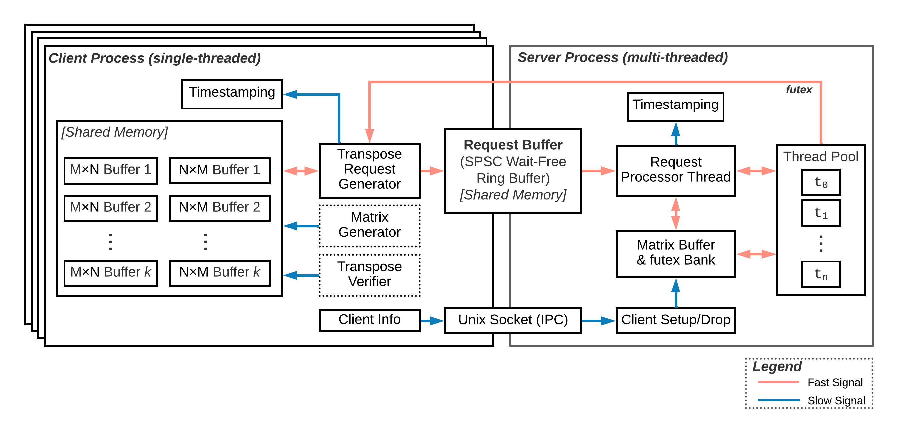
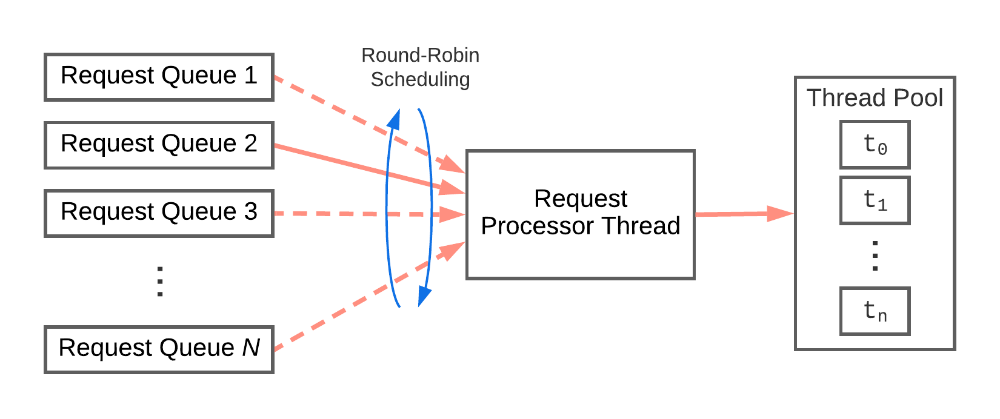
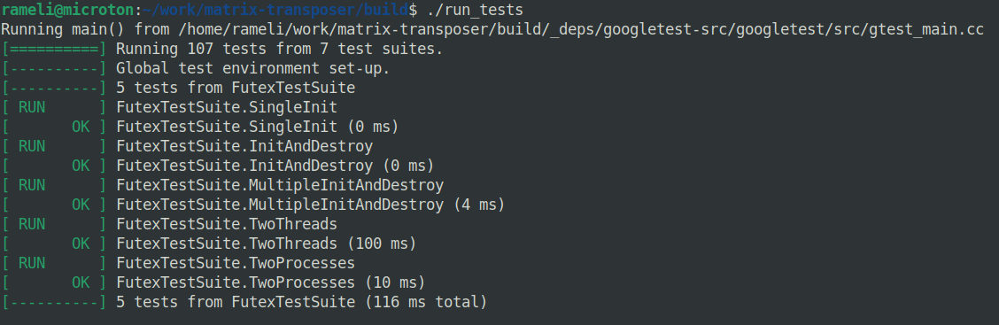
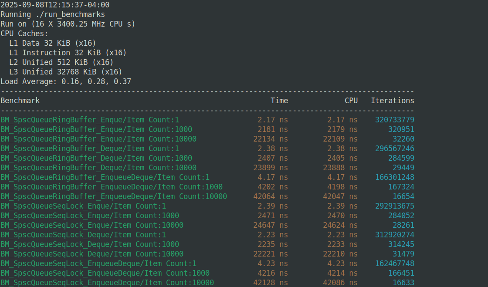

# matrix-transposer
Multi-process high-throughput matrix transpose calculator for large matrices with power-of-2 dimensions

# Operation
This system has a client-server architecture that runs on the same system (shared memory). Only a single server process can be run which can serve multiple client processes.

The server process starts before the client processes and listens on a Unit socket at `/tmp/transpose_server.sock`. 

Client processes subscribe to the server but opening the Unix socket and providing the following:
- Client process id (`PID`)
- Number of matrixes via parameter `k`
- Matrix row count in via parameter `m` where number of rows is $2^m$
- Matrix column count in via parameter `n` where number of rows is $2^n$

Once a client subscribes to the server, the server creates a `ClientContext` object, notifies the client process and waits for incoming requests via Single Producer Single Consumer Queue Sequence Lock (`SpscQueueSeqLock`) mechanism.



Inside the server, the client requests are processed in a round-robin fashion as shown below.


Once a matrix is processed by the server, the client process is notified via a futex (`FutexSignaller`).

# Requirements
- **Ubuntu version**: 25.04 (Plucky Puffin)
- **Linux Kernel Version**: 6.14.0-29-generic
- **GCC**: 15.0.1 20250404
- **CMAKE**: 3.31.6

# Setup
Software requirements are listed in [Requirements](#Requirements).

To manually check installed software components on Ubuntu
```bash
source /etc/os-release && echo "Ubuntu version: $VERSION"
gcc --version
cmake --version
git --version
```

Once supported software versions are installed
```bash
git clone https://github.com/rameli/matrix-transposer.git
mkdir -p matrix-transposer/build
cd matrix-transposer/build

cmake ..
make -j
```

This will build the project, the demos binaries, unit tests and benchmarking binaries. 

Note that the proper versions of GoogleTest and (Google) Benchmark are automatically downloaded by CMAKE.

# How to Run
Once the project is built, the server can be started via an arbitrary number of client processes (up to `MAX_CLIENTS`).

To run the server, use `transpose_server` in the build directory. The only argument is the number of matrix processing threads which must be a power of two.
```bash
# Remove shared memory handles in case server was terminated unexpectedly
rm -rf /dev/shm/*

# Start the server with 8 matrix processing threads
./transpose_server 8 > server_errors.log
Server PID: 338862
Running 8/16 worker threads
Press Enter to stop the server
```

A client process requires 4 parameters which are respectively `m`, `n`, `k` describing matrix sizes and `r` which is the number of repetitions.
```bash
# Start a client process requesting 12 matrixes to be processed
# Each matrix has 2^8 rows and 2^9 colums
# Each matrix is sent 250 times to the server
./transpose_client 8 9 12 250 > client_errors.log
client: 338944, m: 8, n: 9, k: 12, reps: 250, reqs: 3000, avgTime: 735476 (ns)
```

The server logs the connected clients and the processing times to console.
```bash
./transpose_server 8 > server_errors.log
Server PID: 338862
Running 8/16 worker threads
Press Enter to stop the server
New client: 338944
client: 338944, m: 8, n: 9, k: 12, totalReqs: 3000, avgTime: 696014 (ns)
```

# Tests
While in `matrix-transposer/build`, to run unit tests after building the project
```bash
./run_tests
```


# Benchmarking
Performance of various software components are thoroughly benchmarked.

While in `matrix-transposer/build`, to run unit tests after building the project
```bash
./run_benchmarks
```

